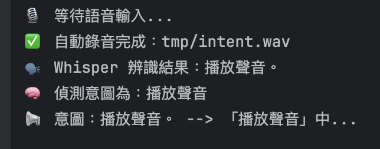

# Speech Controller 語音控制器

基於 Python 的語音識別與控制系統，允許使用語音指令控制各種系統功能。

## 功能特色
- 語音識別
- 語音指令處理
- 透過語音指令控制系統
- 可配置的指令映射

## 系統需求
- Python 3.12 或更高版本
- 麥克風/相機存取權限
- 音訊輸入/輸出功能

## 安裝與執行
測試環境: Mac OS

1. 安裝 uv 
```shell
brew install uv
```
2. 安裝 portaudio
```shell
brew install portaudio
```
3. 執行
```shell
uv venv
source .venv/bin/activate
uv pip install .
python main.py
```

## 執行結果
### 播放聲音


### 語音轉文字


### 偵測人數
